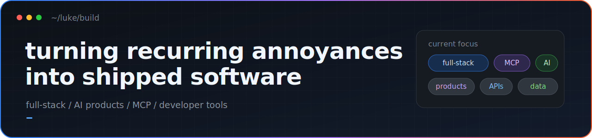

# Luke Fairbanks

  

I build local-first macOS apps and developer tools that coding agents can actually use.

I'm a computer science student at Brigham Young University and a software developer on the Innovation Team at eAssist Dental Solutions. I like turning recurring annoyances into focused products that run locally, respect their users, and do one job well.

  <a href="https://www.linkedin.com/in/luke-fairbanks">LinkedIn</a>

## Featured work

### [Harbor](https://github.com/luke-fairbanks/harbor-mcp)

A native macOS control plane for local dev servers, with smart ports, crash recovery, live monitoring, and an authenticated MCP interface for Claude and Codex.

`Rust` `Tauri 2` `React` `MCP`

[Source](https://github.com/luke-fairbanks/harbor-mcp) · [Download](https://github.com/luke-fairbanks/harbor-mcp/releases/latest) · `brew install --cask luke-fairbanks/tap/harbor`

### [Battery Hog](https://github.com/luke-fairbanks/BatteryHog)

A 100% local macOS battery and energy monitor that turns built-in system telemetry into live power draw, per-app impact, charge history, and practical drain insights.

`Swift` `Python` `WebKit` `macOS`

[Source](https://github.com/luke-fairbanks/BatteryHog) · [Download](https://github.com/luke-fairbanks/BatteryHog/releases/latest) · `brew install --cask luke-fairbanks/tap/battery-hog`

### [broll](https://github.com/luke-fairbanks/broll)

An MCP content studio for coding agents: generate media with your own keys, then render videos and carousels deterministically. Every post lands in a reviewable outbox and requires confirmation to publish.

`TypeScript` `MCP` `FFmpeg` `Sharp`

[Source](https://github.com/luke-fairbanks/broll) · [See it in action](https://luke-fairbanks.github.io/broll/) · `npx broll-mcp`

### [Tab Tamer](https://github.com/luke-fairbanks/TabTamer)

A tiny privacy-first Chrome extension that reclaims memory by discarding inactive background tabs—without access to URLs, page content, or browsing history.

`Chrome MV3` `JavaScript` `2 permissions` `0 network requests`

[Source and install guide](https://github.com/luke-fairbanks/TabTamer)

## More things I've built

- [QuizletLocal](https://github.com/luke-fairbanks/quizlet-local) — import Quizlet sets and study locally, without ads or accounts.
- [RetroRacer](https://github.com/luke-fairbanks/racer-learning-model) — a continuous-control racing environment for training agents with Soft Actor-Critic.
- [Mini Search Engine](https://github.com/luke-fairbanks/search-engine) — crawl the web, then rank results with BM25 and PageRank and explore the graph visually.

## Toolbox

Most often: **TypeScript + React**, **Rust + Tauri**, **Swift + macOS**, and **Python**. I pick the stack around the problem; the current bias is native, local, and dependency-light.

## Recently shipped

<!-- releases:start -->
- [broll-mcp v0.1.1](https://www.npmjs.com/package/broll-mcp/v/0.1.1) — July 12, 2026
- [Harbor v0.1.0](https://github.com/luke-fairbanks/harbor-mcp/releases/tag/v0.1.0) — July 10, 2026
- [Battery Hog 1.1](https://github.com/luke-fairbanks/BatteryHog/releases/tag/v1.1) — July 10, 2026
<!-- releases:end -->

Updated weekly by a small script in this repository.

## Contact

For bugs and feature ideas, open an issue in the relevant repository. For everything else, [connect with me on LinkedIn](https://www.linkedin.com/in/luke-fairbanks).
